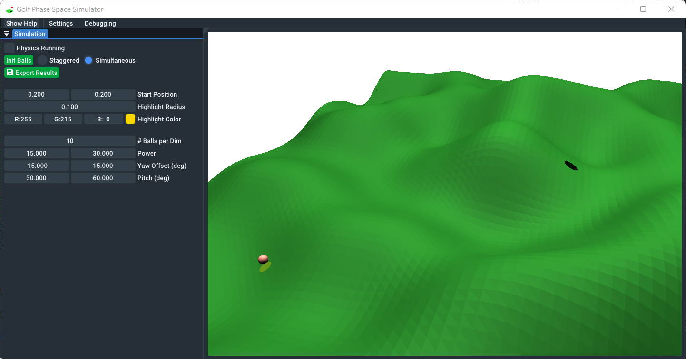
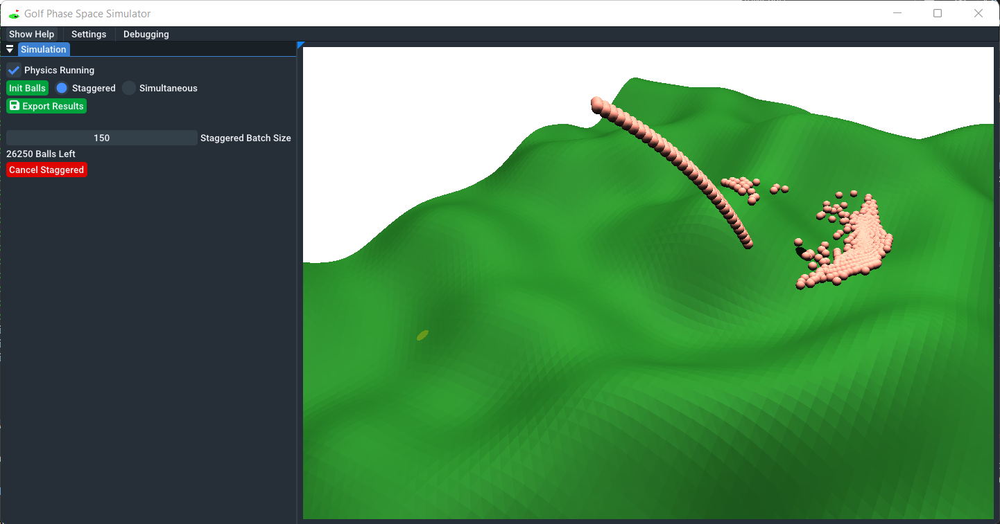
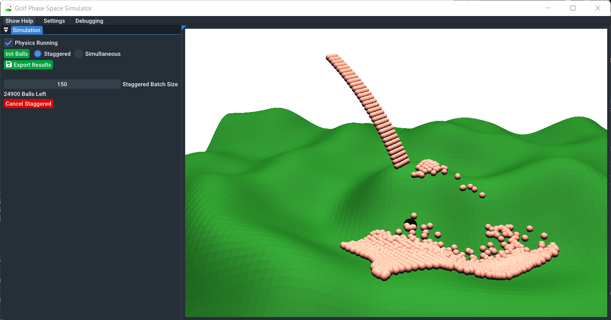
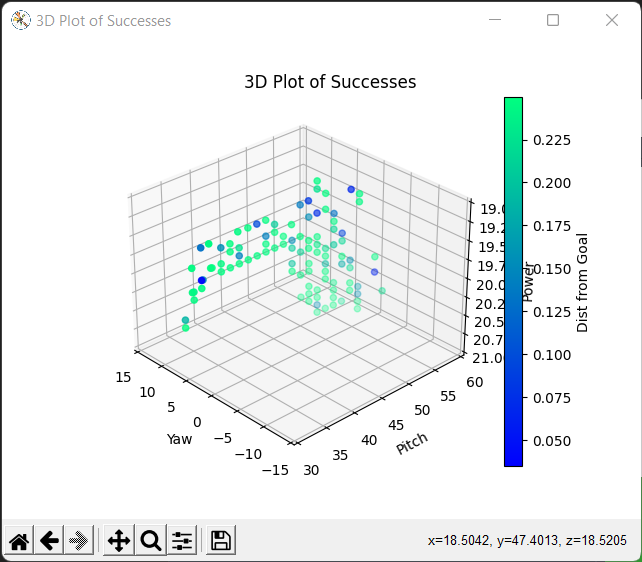
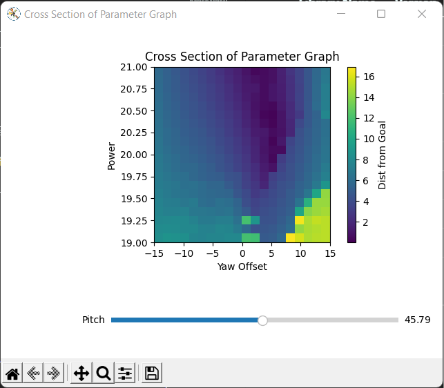
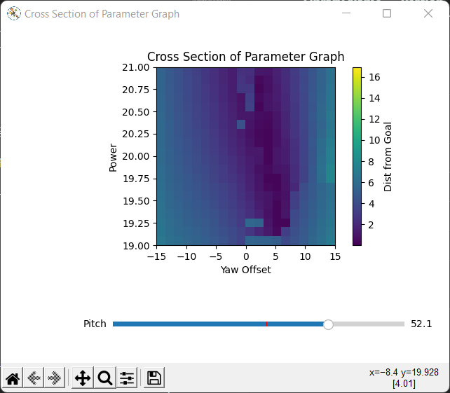

# Golf Parameter Solver

Have you ever played golf and just barely missed the goal? Have you wondered whether just slightly changing your aim or power would have gone in?

GPS (Golf Parameter Solver) is a simulation tool that launches up to tens of thousands of golf shots with varying power, pitch, and yaw to analyze the game of golf and visualize exactly which golf shots would go in for a randomly generated terrain.

  
   
  

After simulating golf shots, the resulting data can be analyzed visually in matplotlib using a provided script.

  

With a 3D scatter plot of the parameters for all of the shots that landed in the goal, a hyperplane emerges with all of the plots lying on a "rainbow shape" more densely distributed towards the latter end, indicating that a higher pitch led to more successes. Almost of the successes have a yaw offset in the range of 0 deg to +5 deg, indicating that aiming slightly to the left of the goal was most beneficial (which makes sense because there is a hill to the left for the golf shot to roll in).

  
  

With 2D colormaps of the data, we can see for a given pitch, which combinations of yaw and power led to the closest shots to the goal. In these images, the area that lands closest to the goal for each pitch generally tends to be a triangle opening upwards, indicating that for the most leeway in your golf shot, you should aim slightly to slightly overshoot your shot.

## Usage

To download the latest version of the app, go to the Releases page and download the.zip file. Unzip using your program of choice, and run GolfSimulator.exe to open the simulator. Instructions for the controls and how to use the app are included in a help window that appears when you open the app. If you accidentally close it or want to see it again, you can press the "Show Help" button in the top left.

After using the golf simulator, you can choose to export the results file as a `.golf` file. From here, make sure you have Python 3 with tkinter, matplotlib, and numpy installed. You can open a terminal to `/Params-Viz/` and then run `python script.py` or `python3 script.py` (depending on your Python installation) to launch the visualization. Select your `.golf` file and then two windows should appear, one displaying the parameters that successfully landed in the goal and another displaying a colormap of the distance from the goal for a cross section of the data. Both visuals should be pannable and scrollable according to normal matplotlib controls. For testing purposes, the .golf file used for the above screenshots is included in the project.

## Development / Tech Stack Breakdown

GPS is built of two components: the golf simulator where you can tweek the exact parameters of golf shots to try, and the parameter visualizer which allows you to visualize exactly which golf shots would go in.

### Golf Simulator

The golf simulator is built with reactphysics3d for simulating the golf shots, OpenGL for rendering the golf course, and Dear ImGui for the user interface. It is currently only built for Windows. The OpenGL backend is built on top of Cherno's OpenGL-Core library that uses premake for generating project files.

#### Generating and Running Visual Studio Project on Windows

Run `scripts/Win-Premake.bat` to generate the `Golf-Sim.sln` Visual Studio project file that you can then open. From there, it should be possible to just push the run buttom to run the app.

### Params Visualizer

The parameter visualizer is built primarily with matplotlib, with tkinter being used for the file dialog. All of the main code is in `/Params-Viz/script.py`, with `/Params-Viz/file.py` being used for loading the results file created by the golf simulator.

## Dependencies

### Golf Simulator

A `*` next to the version number means it was either updated or added from Cherno's OpenGL-Core library.
| Library Name                   | Version | Purpose                                                          |
|--------------------------------|---------|------------------------------------------------------------------|
| Glad                           | 0.1.28  | Loading OpenGL Core 4.6 functions                                |
| GLFW                           | 3.4     | Creating windows, reading input, handling events, etc.           |
| GLM                            | 0.9.9   | Doing math with matrices and vectors in a format similar to GLSL |
| Dear ImGui                     | 1.84\*  | GUI for adjusting settings and displaying info                   |
| spdlog                         | 1.5.0   | Logging                                                          |
| stb_image                      | 2.23    | Image loader                                                     |
| reactphysics3d                 | 0.9.0\* | Handling 3d physics collisions                                   |
| ImPlot                         | 0.12\*  | Addon to Dear ImGui that adds plotting functionality             |
| Font Awesome                   | 6.1.1\* | Font for icons                                                   |

### Params Visualizer

Python 3.6 is required along with numpy, matplotlib, and tkinter. You can use pip to install these, although a platforn like Anaconda or Miniconda is highly recommended.

## Inspiration

The idea for this video was originally inspired by [this YouTube video](https://www.youtube.com/watch?v=b-pLRX3L-fg) by [AlphaPhoenix](https://www.youtube.com/c/AlphaPhoenixChannel). When watching his video, I was looking for a new project and I had been dabbling with a bit of OpenGL. As a result, I was super curious to try implementing my own version of his program, but with an extra visualization (the 3D scatter plot of successes) and with a full GUI for customizing the exact parameters of the simulation.
